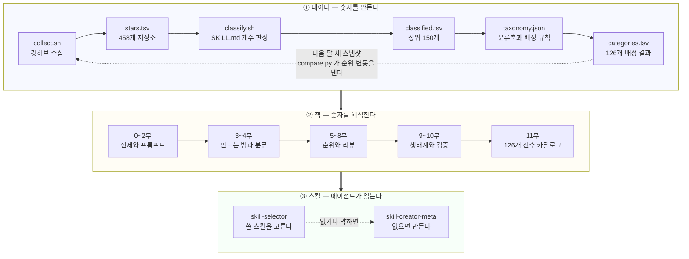
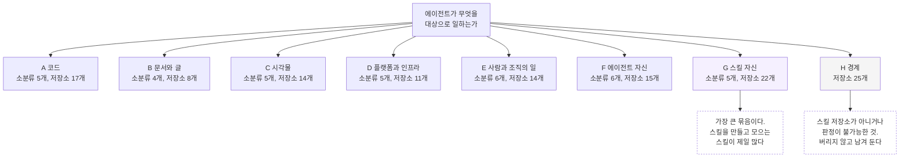
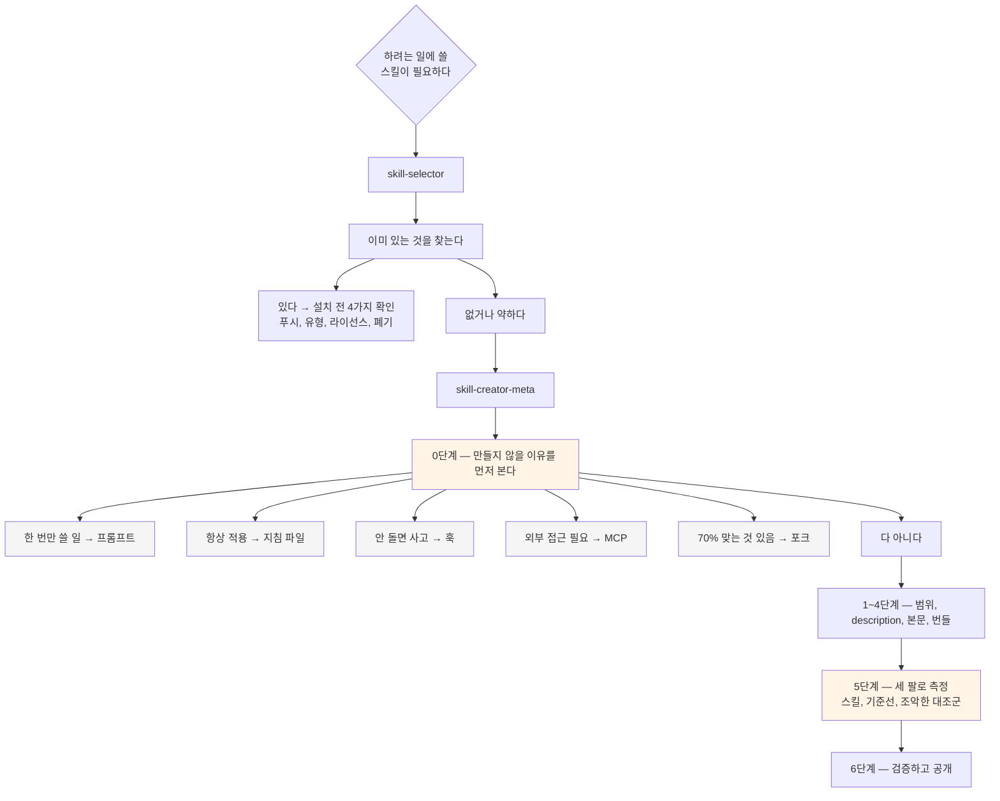

# skills — 에이전트 스킬 리뷰

**AI 엔지니어 leaf meta가 선별한 스킬셋 모음.** 깃허브 스타수를 축으로 정리한 AI 에이전트 스킬 생태계 리뷰서다.

스킬을 어떻게 쓰는지 알려주는 입문서가 아니다. 지금 생태계에 무엇이 나와 있고, 그중 무엇이 왜 쓰이는지를 판단하는 책이다. 만드는 법(프롬프트, 스킬 작성), 분류(스킬의 종류), 리뷰(스타수 순위, 빅테크, 개인, 도메인별)를 함께 다룬다.

---

## 이 저장소에 대하여

이 저장소는 **leaf meta가 직접 관리하는 스킬 메타인지 저장소다.** 한 번 쓰고 닫는 원고가 아니다.

**메타인지 관점으로 본다.** 개별 스킬의 사용법보다 그 바깥을 본다. 왜 이 스킬이 많이 쓰이는가. 스타수는 무엇을 말하고 무엇을 숨기는가. 같은 일을 하는 스킬이 왜 수십 개씩 생기는가. 스킬을 쓰는 책이 아니라 스킬 생태계를 읽는 책이다.

**계속 갱신한다.** 인기 스킬 목록은 빠르게 바뀐다. 2026년 10월에 1위인 저장소가 다음 분기에 10위일 수 있다. leaf meta가 데이터를 주기적으로 다시 수집하고 순위와 리뷰를 갱신한다. 갱신 규칙은 [9.6 이 저장소의 갱신 규칙](part9/06-update-policy.md)에 적어 둔다.

**숫자는 손으로 적지 않는다.** 모든 순위는 [`data/collect.sh`](data/collect.sh)의 출력에서만 가져온다. 누구든 같은 스크립트를 돌려 같은 표를 다시 만들 수 있다. 현재 데이터는 [`data/snapshots/2026-10/stars.tsv`](data/) 기준이며, 458개 저장소를 담고 있다.

형식은 마크다운이다. 깃허브에서 읽는 것을 전제로 하고 PDF는 만들지 않는다. 분량은 종이책 기준 약 400쪽이다.

---

## 한눈에 보는 구조

이 저장소는 세 겹이다. **데이터**가 숫자를 만들고, **책**이 그 숫자를 해석하고, **스킬**이 책을 에이전트에게 읽어 준다.



**데이터 층 안에서 되돌아가는 점선이 이 저장소의 성격이다.** 한 번 쓰고 닫는 원고가 아니라 월 단위로 다시 수집해 순위를 갱신하는 메타인지 저장소다. 같은 스크립트를 돌리면 같은 표가 다시 나온다.

### 분류 체계

11부는 수집한 저장소 126개를 **하나의 축**으로 가른다. "에이전트가 무엇을 대상으로 일하는가"다. 저장소가 두 곳에 걸치면 세 가지 타이브레이크 규칙으로 정한다([11.1](part11/01-taxonomy.md)).



**H를 남겨 두는 것이 MECE의 조건이다.** 분류가 안 되는 것을 억지로 밀어 넣으면 다른 칸의 숫자가 거짓이 된다.

---

## 이 저장소를 스킬로 받아 쓴다

이 저장소는 사람이 읽는 책이면서 **코딩 에이전트가 읽는 지도**다. 지도를 읽는 스킬 둘을 함께 넣어 두었다.

```
skills/
├── skill-selector/          쓸 스킬을 고른다
│   ├── scripts/query.py             분류 데이터 조회
│   └── references/category-map.md   36개 소분류와 소속 저장소
└── skill-creator-meta/      스킬을 만든다
    ├── scripts/check_duplicate.py   만들기 전에 중복을 찾는다
    ├── scripts/validate_skill.py    규격과 이 책의 원칙을 검사한다
    ├── references/checklist.md      0단계부터 공개까지
    ├── references/eval-design.md    평가 설계와 어서션 함정
    └── assets/template/             스킬 뼈대
```

둘은 반대 방향을 본다.



**노란 두 칸이 이 저장소가 더한 부분이다.** 0단계는 생태계에 중복이 폭발한 원인을 막고([9.5](part9/05-saturation.md)), 5단계의 세 번째 팔은 설계가 실제로 기여했는지를 가른다([10.2](part10/02-validation.md)).

### 설치

```bash
git clone https://github.com/leaf-kit/skills.git
```

쓰는 도구에 맞는 자리에 스킬 디렉터리를 복사하거나 심링크를 건다.

```bash
# Claude Code
ln -s "$(pwd)/skills/skills/skill-selector"     ~/.claude/skills/skill-selector
ln -s "$(pwd)/skills/skills/skill-creator-meta" ~/.claude/skills/skill-creator-meta

# 다른 도구는 각자의 스킬 디렉터리에 같은 방식으로 건다
```

**심링크를 권한다.** 저장소를 `git pull` 하면 스킬도 같이 갱신된다. 데이터가 월 단위로 쌓이므로 복사본은 금세 낡는다.

**둘 중 하나만 걸어도 된다.** `skill-selector`는 데이터에 의존하므로 저장소 안에 있어야 하고, `skill-creator-meta`는 `check_duplicate.py`를 쓸 때만 저장소가 필요하다.

### skill-selector — 쓸 스킬을 고른다

설치 후 평소대로 물으면 된다.

```
코드 리뷰를 에이전트한테 맡기고 싶은데 쓸 만한 스킬 있어?
남이 만든 스킬 설치하려는데 안전한지 어떻게 확인해?
에이전트 스킬에 어떤 카테고리들이 있어?
```

스킬 없이 데이터만 쓰려면 스크립트를 직접 돌린다.

```bash
cd skills/skills/skill-selector
./scripts/query.py --list                 # 36개 소분류 전체
./scripts/query.py --category A3          # 보안 저장소
./scripts/query.py --search "메모리"       # 키워드 검색
./scripts/query.py --stale                # 갱신이 멈춘 저장소
```

**스타수로 추천하지 않는다.** 이 저장소의 전제가 "스타수는 품질이 아니라 주목을 잰다"이기 때문이다([0.2](part0/02-why-stars.md)). 추천할 때 네 가지를 같이 확인하고, **설치 전 스캔**을 안내한다. 스킬 네 개 중 하나에 취약점이 있다([9.3](part9/03-supply-chain.md)).

**수집 데이터에 없으면 없다고 말한다.** 150위 밖은 기계 판정을 하지 않았으므로 누락이 있다.

### skill-creator-meta — 스킬을 만든다

Anthropic 공식 `skill-creator`를 대체하지 않는다. 공식 스킬은 뼈대를 만들고 `description`을 다듬는 데 강하다. 이 스킬은 거기에 **0단계와 5단계**를 더한 것이다.

```
이거 매번 설명하기 번거로운데 스킬로 만들어줘
커밋 메시지 컨벤션 지키게 하는 스킬 하나 만들어줘
이 스킬 평가 어떻게 짜야 해?
```

스크립트는 따로도 쓸 수 있다.

```bash
cd skills/skills/skill-creator-meta
./scripts/check_duplicate.py "PR 디프에서 팀 컨벤션 위반을 찾는다"
./scripts/validate_skill.py ~/.claude/skills/my-skill
```

`validate_skill.py`는 규격 위반을 `ERROR`로, 이 저장소가 측정에서 확인한 설계 문제를 `WARN`으로 낸다. 검사 항목에 **제외 조건 누락**, **과잉 적용 방지 절 누락**, **두 방향 실패의 비용 비교 누락**, **부정형 어서션 편중**, **기준선과 조악한 대조군 누락**이 들어 있다. `skills-ref validate`가 보지 않는 것들이다.

**이 스킬이 하지 않는 것.** 중복 여부를 판정하지 않는다. 키워드가 겹치는 후보를 내놓을 뿐이고 판단은 사람이 한다. 그리고 `WARN`은 전부 고쳐야 하는 목록이 아니다. 각 항목에 이유가 붙어 있으니 근거를 적을 수 있으면 무시해도 된다.

**두 스킬 모두 자기 평가 결과가 없다.** 자극은 정의했고 측정은 아직 하지 않았다. 각 스킬의 `evals/README.md`에 그 사실을 적어 두었다.

---

## 읽는 경로

차례대로 읽지 않아도 된다. 목적에 따라 들어오는 곳이 다르다.

| 당신이 | 여기서 시작 |
|---|---|
| 스킬을 처음 만든다 | [1부 스킬이란 무엇인가](#1부--스킬이란-무엇인가) → [3부 스킬 작성법](#3부--스킬-작성법) |
| 쓸 스킬을 고르고 있다 | [11부 스킬 카탈로그](#11부--스킬-카탈로그-전수-분류) → [8부 도메인별 리뷰](#8부--도메인별-리뷰) |
| 어떤 카테고리가 있는지 보고 싶다 | [11.1 전체 카테고리 지도](part11/01-taxonomy.md) |
| 보안 스킬을 고른다 | [11.10 보안 스킬](part11/10-security.md) |
| 생태계 전체를 보고 싶다 | [0부](#0부--이-저장소와-이-책) → [5.4 순위에서 읽히는 패턴](part5/04-patterns.md) → [9부](#9부--생태계를-읽는-눈) |
| 프롬프트부터 다듬고 싶다 | [2부 프롬프트 작성법](#2부--프롬프트-작성법) |
| 남이 만든 스킬을 믿어도 되는지 알고 싶다 | [9.3 공급망 위험](part9/03-supply-chain.md) |
| 에이전트에게 이 저장소를 읽히고 싶다 | [이 저장소를 스킬로 받아 쓴다](#이-저장소를-스킬로-받아-쓴다) |

---

## 차례

### 0부 — 이 저장소와 이 책

- [0.1 leaf meta가 관리하는 스킬 메타인지 저장소](part0/01-this-repository.md)
- [0.2 왜 스타수인가, 그리고 스타수를 믿지 않는 법](part0/02-why-stars.md)
- [0.3 이 책을 읽는 법](part0/03-how-to-read.md)

### 1부 — 스킬이란 무엇인가

- [1.1 프롬프트에서 스킬로](part1/01-from-prompt-to-skill.md)
- [1.2 SKILL.md 한 장의 구조](part1/02-anatomy.md)
- [1.3 점진적 공개](part1/03-progressive-disclosure.md)
- [1.4 스킬, 서브에이전트, MCP, 플러그인, 훅](part1/04-boundaries.md)
- [1.5 스킬은 어떻게 선택되는가](part1/05-triggering.md)

### 2부 — 프롬프트 작성법

- [2.1 좋은 프롬프트의 기준](part2/01-criteria.md)
- [2.2 왜를 적는 프롬프트](part2/02-explain-why.md)
- [2.3 길게 쓰면 해결된다는 오해](part2/03-length-myth.md)
- [2.4 출력 형식 설계](part2/04-output-format.md)
- [2.5 예시의 비용과 효과](part2/05-examples.md)
- [2.6 프롬프트를 스킬로 승격시키는 시점](part2/06-promotion.md)

### 3부 — 스킬 작성법

- [3.1 의도 포착](part3/01-capture-intent.md)
- [3.2 description 설계](part3/02-description.md)
- [3.3 본문 쓰기](part3/03-body.md)
- [3.4 references 설계](part3/04-references.md)
- [3.5 scripts 설계](part3/05-scripts.md)
- [3.6 assets와 출력물 템플릿](part3/06-assets.md)
- [3.7 평가 만들기](part3/07-evals.md)
- [3.8 반복 개선과 배포](part3/08-iterate-and-ship.md)

### 4부 — 스킬의 종류

- [4.1 분류 체계 세우기](part4/01-taxonomy.md)
- [4.2 실행형, 지식형, 방법론형](part4/02-three-types.md)
- [4.3 단일 스킬, 번들, 마켓플레이스](part4/03-scale.md)
- [4.4 메타스킬](part4/04-meta-skills.md)

### 5부 — 스타수 전체 순위

- [5.1 수집과 선별](part5/01-collection.md)
- [5.2 톱 30 정밀 리뷰](part5/02-top50.md)
- [5.3 31위 이하 요약 리뷰](part5/03-rest.md)
- [5.4 순위에서 읽히는 패턴](part5/04-patterns.md)

### 6부 — 빅테크가 낸 스킬

- [6.1 Anthropic — anthropics/skills](part6/01-anthropic-skills.md)
- [6.2 Anthropic — 그 외 저장소](part6/02-anthropic-others.md)
- [6.3 OpenAI — openai/skills](part6/03-openai.md)
- [6.4 Google — skills, agents-cli](part6/04-google.md)
- [6.5 Microsoft — skills, dotnet/skills, SkillOpt, skill-recorder](part6/05-microsoft.md)
- [6.6 Cloudflare — security-audit-skill 외](part6/06-cloudflare.md)
- [6.7 GitHub — awesome-copilot, copilot-plugins](part6/07-github.md)
- [6.8 NVIDIA, Alibaba, AWS, Vercel](part6/08-others.md)

### 7부 — 개인과 커뮤니티가 낸 스킬

- [7.1 obra/superpowers](part7/01-superpowers.md)
- [7.2 addyosmani/agent-skills](part7/02-addyosmani.md)
- [7.3 단일 목적 스킬의 힘](part7/03-single-purpose.md)
- [7.4 큐레이션 저장소의 경제학](part7/04-awesome-lists.md)
- [7.5 지역 생태계](part7/05-regional.md)
- [7.6 개인이 빅테크를 앞지르는 이유](part7/06-why-individuals-win.md)

### 8부 — 도메인별 리뷰

- [8.1 보안](part8/01-security.md)
- [8.2 코드리뷰](part8/02-code-review.md)
- [8.3 빌더, 메타](part8/03-builders.md)
- [8.4 메모리, 컨텍스트](part8/04-memory.md)
- [8.5 문서, 글쓰기](part8/05-writing.md)
- [8.6 연구](part8/06-research.md)
- [8.7 디자인, 다이어그램](part8/07-design.md)
- [8.8 제품, 업무](part8/08-product.md)
- [8.9 코드 이해, 지식 그래프](part8/09-code-understanding.md)

### 9부 — 생태계를 읽는 눈

- [9.1 스타수의 함정](part9/01-star-traps.md)
- [9.2 스킬 품질을 재는 방법](part9/02-measuring-quality.md)
- [9.3 공급망 위험](part9/03-supply-chain.md)
- [9.4 라이선스와 출처](part9/04-licensing.md)
- [9.5 중복과 포화](part9/05-saturation.md)
- [9.6 이 저장소의 갱신 규칙](part9/06-update-policy.md)

### 10부 — 직접 만들기

- [10.1 케이스: diff-review](part10/01-case-study.md)
- [10.2 평가로 검증하기](part10/02-validation.md)
- [10.3 공개할 때](part10/03-publishing.md)

### 11부 — 스킬 카탈로그 (전수 분류)

- [11.1 분류 체계 — 전체 카테고리 지도](part11/01-taxonomy.md)
- [11.2 A. 코드](part11/02-code.md)
- [11.3 B. 문서와 글](part11/03-writing.md)
- [11.4 C. 시각물](part11/04-visual.md)
- [11.5 D. 플랫폼과 인프라](part11/05-platform.md)
- [11.6 E. 사람과 조직의 일](part11/06-work.md)
- [11.7 F. 에이전트 자신](part11/07-agent.md)
- [11.8 G. 스킬 자신](part11/08-meta.md)
- [11.9 H. 경계](part11/09-boundary.md)
- [11.10 보안 스킬](part11/10-security.md)

### 부록

- [A. 데이터 수집 스크립트와 재현 방법](appendix/a-data.md)
- [B. 저장소 색인](appendix/b-index.md)
- [C. 용어집](appendix/c-glossary.md)
- [D. 참고 자료](appendix/d-references.md)

---

## 이 책이 찾아낸 것

리뷰에서 나온 발견 중 다른 데서 보기 어려운 것들이다. 전부 1차 자료에서 확인했다.

**스킬 네 개 중 하나에 취약점이 있다.** `NVIDIA/SkillSpector`가 분석한 31,132개 중 26.1%가 취약점을 포함하고 5.2%가 악의적 의도로 보인다. 스킬은 설치가 마크다운 파일 복사이고 검증 관례가 없는데, 에이전트가 읽고 그대로 따르는 지시문이다. → [9.3](part9/03-supply-chain.md)

**폐기된 저장소가 후속 저장소보다 3.8배 주목받는다.** `openai/skills`(27,856)는 폐기됐고 `openai/plugins`(7,276)가 현행이다. 폐기 사실은 설명, 토픽, 검색 결과에 없고 README 첫 단락에만 있다. → [6.3](part6/03-openai.md)

**평가 인프라가 가장 좋은 저장소는 1위의 1.9%다.** `dotnet/skills`(5,543)는 기준선 저장, 비교, 평가 품질 게이트, 통계적 검정력 하한을 갖췄다. "자극 5개 미만이면 합격도 실패도 아닌 검정력 부족으로 분류한다"를 CI로 강제한다. → [6.5](part6/05-microsoft.md)

**12만 스타 저장소가 규격 파일명을 쓰지 않는다.** `Graphify-Labs/graphify`(123,488)는 `SKILL.md`가 0개이고 `graphify/skill-<도구>.md`로 스킬 12개를 담는다. 이 책의 기계 선별에서 전체 8위가 빠졌고, 그 사실을 기록으로 남겼다. → [8.9](part8/09-code-understanding.md)

**AI 글 교정 스킬이 세 언어로 각각 존재한다.** 번역으로 해결되지 않는다 — 번역투는 영어 목록에 있을 수 없고, 엠 대시 남용은 한국어에서 문제가 안 된다. 낭비성 중복과 필요한 재구현을 가르는 기준이 여기서 나온다. → [8.5](part8/05-writing.md), [9.5](part9/05-saturation.md)

**규격 공개 2주 뒤에 생태계가 움직였다.** `anthropics/skills` 생성(2025-09-22) 직후 달에 신규 저장소가 3개에서 31개로 뛰었다. 전체가 1년 안쪽이고, 2026년 4월을 정점으로 신규 생성이 감소하고 있다. → [5.4](part5/04-patterns.md)

**상위 60개 중 4개는 루트 라이선스 파일이 없다.** 그중 둘이 공식 저장소다. `anthropics/skills`는 스킬별 `LICENSE.txt` 18개를 두는데(스킬은 20개) 깃허브가 식별하지 못한다. → [9.4](part9/04-licensing.md)

**description 설계의 최고 사례는 `google/skills`의 `index.json`이다.** 제외 조건마다 어느 형제 스킬로 가야 하는지를 적었다. 155개 규모에서 트리거 충돌을 관리하는 방법이다. → [6.4](part6/04-google.md)

## 구성

62장 + 부록 4편.

| 부 | 장 | 다루는 것 |
|---|---|---|
| 0부 | 3 | 이 저장소의 성격, 스타수에 대한 태도 |
| 1부 | 5 | 스킬이란 무엇인가 — 규격, 점진적 공개, 경계, 트리거 |
| 2부 | 6 | 프롬프트 작성법 |
| 3부 | 8 | 스킬 작성법 — description, 본문, 번들, 평가, 배포 |
| 4부 | 4 | 스킬의 종류 — 유형, 규모, 메타스킬 |
| 5부 | 4 | 스타수 전체 순위 — 수집, 선별, 톱 30, 패턴 |
| 6부 | 8 | 빅테크 스킬 — Anthropic, OpenAI, Google, MS, Cloudflare, GitHub, NVIDIA, Alibaba |
| 7부 | 6 | 개인, 커뮤니티 스킬 |
| 8부 | 9 | 도메인별 — 보안, 리뷰, 빌더, 메모리, 문서, 연구, 디자인, 제품, 코드이해 |
| 9부 | 6 | 생태계를 읽는 눈 — 함정, 측정, 공급망, 라이선스, 포화, 갱신 |
| 10부 | 3 | 직접 만들기 — 케이스, 검증, 공개 |
| 11부 | 10 | 스킬 카탈로그 — 126개 전수 MECE 분류, 언제 쓰나 |
| 부록 | 4 | 데이터 재현, 저장소 색인, 용어집, 참고 자료 |

## 데이터

| 항목 | 값 |
|---|---|
| 수집 날짜 | 2026-10-04 |
| 수집 저장소 수 | 458 |
| 판정 대상 | 상위 150개 |
| `SKILL.md` 보유 | 126개 |
| 수집 방법 | `gh` CLI — 토픽 6개 검색 + 기준점 저장소 21개 직접 조회 |
| 원본 | [`data/snapshots/2026-10/stars.tsv`](data/) |
| 스크립트 | [`data/collect.sh`](data/collect.sh), [`data/classify.sh`](data/classify.sh) |
| 재현 방법 | [부록 A](appendix/a-data.md) |

스타수는 수집 시점의 값이다. 날짜 없는 스타수는 숫자가 아니라 인상이므로, 본문의 모든 순위표에는 수집 날짜를 붙인다.

**숫자가 책과 다르면 오류가 아니라 날짜 차이다.** 하루에 1,000개 넘게 스타가 붙는 저장소가 있다.

## 이 책이 하지 않은 것

정직하게 적어 둔다.

| 항목 | 상태 |
|---|---|
| 리뷰 대상의 보안 스캔 | **하지 않았다** — `SkillSpector`를 돌리지 않았다 |
| 150위 아래 기계 판정 | 하지 않았다 |
| 트리거 측정 | 10부 케이스에서 하지 않았다 |
| 조악한 대조군 비교 | 10부 케이스에서 하지 않았다 |

첫 줄이 가장 큰 공백이다. **본문의 "골라 쓰는 기준" 표들은 설계 품질에 대한 판단이고 안전성 보증이 아니다.** 설치 전 검사를 권하는 이유다.

본문에 남아 있는 `[확인 필요: ...]` 항목들도 미완의 부채다. 다음 갱신의 과제로 [9.6](part9/06-update-policy.md)에 적었다.

## 갱신

| 작업 | 주기 |
|---|---|
| 데이터 재수집 | 1개월 |
| 상위 30개 README 첫 단락 확인 | 1개월 |
| 리뷰 본문 갱신 | 3개월 |
| 선별 규칙 재검토 | 3개월 |

3개월을 고른 근거는 지식형 스킬의 신선도 기준이고, 큐레이션 저장소가 멈춘 사례(5개월)보다 짧게 잡았다. 규칙 전체는 [9.6](part9/06-update-policy.md)에 있다.

## 기여

틀린 것을 발견하면 이슈로 알려 주면 된다.

| 종류 | 처리 |
|---|---|
| 사실 오류 (숫자, 날짜, 구조) | 고치고 수정 기록을 남긴다 |
| 놓친 저장소 | 선별 규칙에 맞는지 확인하고 추가 |
| 판단에 대한 이견 | 근거가 사실과 다르면 고치고, 근거는 맞는데 결론이 다르면 관점 차이다 |

**관점 차이를 지우려고 근거를 바꾸지 않는다.**
